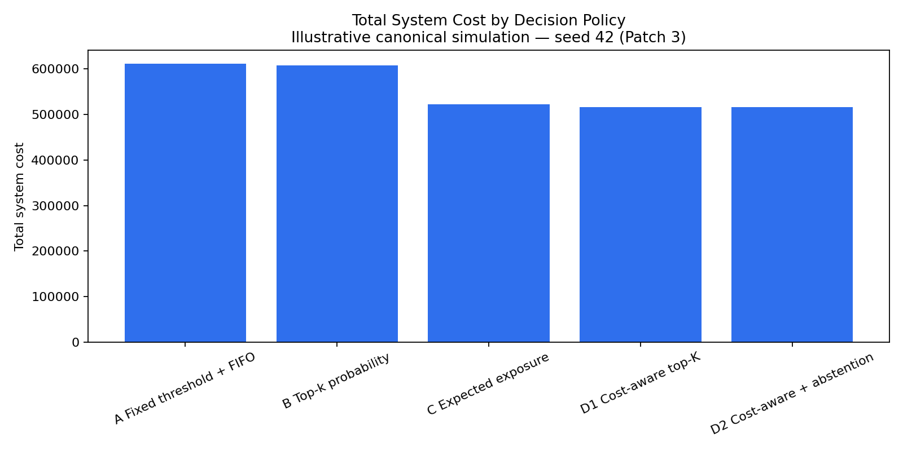
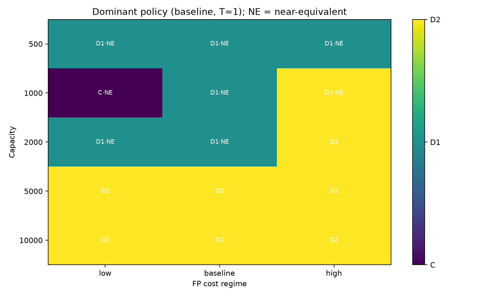
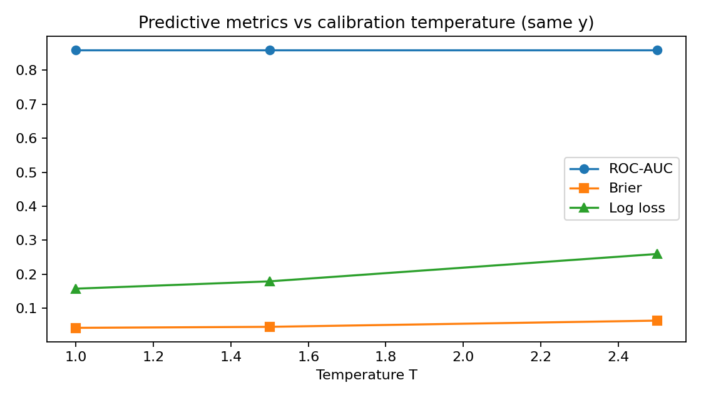
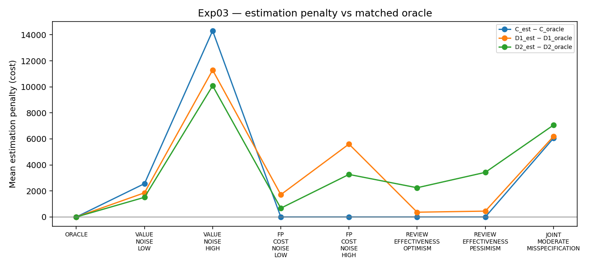

# Same Model, Different Decisions

**A Synthetic Study of Policy Sensitivity Under Capacity, Cost, and Misspecification**

A model score is not a decision.

Suppose a fraud model produces one set of risk scores for 100,000 transactions. One team reviews the highest probabilities. Another ranks by expected loss. A third accounts for review cost and customer friction.

The model has not changed. The operational outcome can.

This project asks how much downstream policy can change simulated system cost when predictive signals remain fixed. The experiments are fully synthetic — no production banking data.

## Question

If predictive scores stay fixed, how much can ranking rules, review capacity, intervention economics, abstention, calibration, and imperfect economic estimates change simulated system cost?

## Short answer

In this simulation, they change it a lot under some setups and only a little under others.

Holding scores fixed, cost-aware ranking beat probability-only ranking on the canonical seed (about $516.3k vs $606.9k simulated cost). Across a pre-specified robustness grid, that advantage held under correctly specified economics, but many cells were near-ties under a project-defined 1% band. When economic exposures were estimated with noise, estimated cost-aware policies still beat estimated-exposure and probability-only ranking in the tested value-noise conditions, while their gap to oracle performance grew as noise increased.

This does not establish that cost-aware policies are universally better. They are scored against a stylized objective related to the quantities used in ranking.

## Framework

Signal → State → Prediction → Constraints → Decision → Action → Feedback

A descriptive checklist for production ML systems — not a new theoretical framework.

## Experiments

| Exp | Focus |
| --- | --- |
| 01 | Same predictions, different review-selection policies |
| 02 | Capacity, prevalence, calibration, false-positive cost |
| 03 | Fair misspecification of economic estimates |

## Findings

### Same scores, different policy, different cost

**Experiment 01 (synthetic).** Canonical seed 42, T=1, e=1, K=2000:

| Policy | Simulated total system cost |
| --- | ---: |
| Top-k probability (B) | ≈ $606.9k |
| Expected exposure (C) | ≈ $521.8k |
| Cost-aware top-k (D1) | ≈ $516.3k |

About $90.6k lower simulated cost for D1 vs B on this seed. Details: `experiments/threshold_capacity/results.md`.



### Operating conditions change which policy looks best

**Experiment 02.** 135 scenarios × 10 seeds.

Only 54 of 135 cells had a clear winner under the project's 1% near-equivalence rule. In 18 cells, fixed-threshold + FIFO was cheapest because it reviewed far fewer cases. Across the grid, under correctly specified economics, paired mean-cost differences favored oracle cost-aware ranking over probability-only ranking in every cell. Experiment 03 drops the “correctly specified” assumption.





### Better economic information helps; bad estimates have a cost

**Experiment 03.** Evaluation always uses true economic loss exposure `v`. Deployable policies may use estimates `v_hat`. Under the pre-specified value-noise conditions, estimated cost-aware policies kept lower mean simulated cost than both estimated-exposure (`C_est`) and probability-only ranking, while the estimation penalty versus matched oracle policies rose with noise (about 1.8–2.5% under high value noise for the matched pairs).



## Methodological corrections / archive

An earlier Experiment 03 draft gave expected-exposure ranking true `v` while estimated cost-aware policies used noisy `v_hat`. That was not a fair comparison. After equalizing the information set, the apparent high-noise reversal disappeared. The superseded run is kept in `archive/superseded_pre_fair_comparator/` rather than deleted.

Earlier corrections also included making the threshold baseline FIFO (so it does not collapse into top-k under a hard capacity) and drawing labels from `p_base` rather than from a temperature-distorted score.

## Limitations

This work is entirely synthetic. It is not a production bank, uses no client data, and reports no realized financial impact.

Review effectiveness is a deterministic fraction of prevented loss. Real review is messier. Economic loss exposure is simulated. Oracle policies are reference bounds, not deployable policies. Results are not universal recommendations.

Full list: [`docs/limitations.md`](docs/limitations.md).

## Reproduction

```bash
python -m venv .venv
source .venv/bin/activate
pip install -r requirements.txt
python -m pytest tests -q
cd experiments/threshold_capacity && python experiment_01.py
python compute_paired_deltas.py
cd ../decision_misspecification && python experiment_03.py
```

Full Experiment 02 grid (heavier: 1,350 dataset draws × 5 policies): `python experiment_02_robustness.py`.

Experiment 02 summary outputs are under `experiments/threshold_capacity/outputs/`. Seeds are fixed in the scripts.

Or: `bash scripts/reproduce_core.sh`

## Repository structure

```
experiments/threshold_capacity/
experiments/decision_misspecification/
figures/
docs/
tests/
archive/superseded_pre_fair_comparator/
```

[`docs/methodology.md`](docs/methodology.md) · [`docs/findings.md`](docs/findings.md) · [`docs/article.md`](docs/article.md)

## License

MIT — see `LICENSE`.

## Author

Shakya Bhattacharyya

## Citation

Bhattacharyya, Shakya. "Same Model, Different Decisions: A Synthetic Study of Policy Sensitivity Under Capacity, Cost, and Misspecification." Independent technical project, 2026.

Not a peer-reviewed paper unless published separately as one.
